# GazeBoard

GazeBoard is an Android research prototype that turns four gaze directions into spoken quick phrases or word selections without sending camera frames to an application server.

> **Current status:** The camera-to-speech path, calibration state machine, word predictor, and Qualcomm SM8750 NPU packaging are implemented. A debug build assembles successfully. Device execution and gaze accuracy have not been re-verified on target hardware. Latency and sustained frame rate were observed during the hackathon build and have not been re-verified since. The repository currently has no automated test cases. See [Validation status](#validation-status) and [Current limitations](#current-limitations).

```mermaid
flowchart LR
    A["Front camera frame"] --> B["ML Kit face and eye landmarks"]
    B --> C["96 x 160 grayscale left-eye crop"]
    C --> D["EyeGaze model via LiteRT CompiledModel"]
    D --> E["Pitch and yaw smoothing"]
    E --> F["Four-point calibration and quadrant mapping"]
    F --> G["One-second dwell selection"]
    G --> H["Quick phrase or dictionary candidate"]
    H --> I["Android text-to-speech"]
```



## What is implemented

- A CameraX analysis pipeline processes the front camera at a requested 640 x 480 resolution and drops stale frames with `STRATEGY_KEEP_ONLY_LATEST`.
- ML Kit detects a face and both eye landmarks. The app crops the left eye, converts it to a 96 x 160 grayscale tensor, and passes it to the checked-in [Qualcomm EyeGaze model](https://huggingface.co/qualcomm/EyeGaze).
- LiteRT's `CompiledModel` API requests the NPU explicitly. There is no CPU or GPU fallback. Model-load failure produces an error screen instead of silently changing accelerators.
- Four 1.5-second calibration samples produce pitch and yaw midpoint thresholds. The thresholds persist in Android `SharedPreferences`.
- A one-second dwell selects one of four quadrants, followed by a 500 ms cooldown.
- The home screen speaks **Yes**, **No**, or **Help**. The fourth quadrant opens spelling mode.
- Spelling mode maps `A-G`, `H-M`, `N-S`, and `T-Z` to four gaze gestures. An ordered, 378-line asset is filtered by gesture prefix and presents up to three candidates for direct selection.
- A debug overlay reports observed frame rate, face-detection time, model-run time, raw pitch and yaw, accelerator label, and current state.

The app manifest requests only camera permission and does not declare Internet permission. The application code contains no network client or analytics integration. Speech output is delegated to the installed Android text-to-speech service, whose language data and network behavior depend on the selected system engine.

## Architecture

The central `GazeBoardViewModel` owns the state machine and consumes a `GazeResult` for each analyzed frame:

```text
Calibrating -> QuickPhrases -> Spelling <-> WordSelection
       |
       +-> ModelLoadError if NPU model loading fails
```

`GazeEstimator` separates frame processing from UI state. It combines ML Kit eye detection, LiteRT inference, exponential moving-average smoothing, and quadrant mapping into a small result object consumed by the ViewModel. The UI observes `StateFlow` values and renders the current Compose screen.

See [docs/ARCHITECTURE.md](docs/ARCHITECTURE.md) for the data contracts, state transitions, and engineering tradeoffs.

## Technology stack

| Area | Implementation |
| --- | --- |
| Language and build | Kotlin 2.0.21, Gradle 8.13, Android Gradle Plugin 8.13.1, Java 17 bytecode target |
| Android target | `minSdk 31`, `targetSdk 35`, arm64 |
| UI and state | Jetpack Compose, Material 3, ViewModel, StateFlow |
| Camera and face detection | CameraX 1.3.4, ML Kit face detection 16.1.7 |
| Gaze inference | LiteRT 2.1.1 `CompiledModel`, Qualcomm EyeGaze TFLite model |
| Target accelerator | Qualcomm SM8750 NPU with bundled v79 runtime libraries |
| Speech | Android `TextToSpeech` |

## Quick start

### Prerequisites

- Android Studio with Android SDK 35 and platform tools
- JDK 17 or a compatible newer JDK, including the JDK bundled with a current Android Studio release
- A USB-connected, arm64 Android device with USB debugging enabled
- For gaze inference, the current packaging targets Qualcomm SM8750 hardware, such as the Snapdragon variant of the Samsung Galaxy S25 Ultra
- Network access for the first Gradle dependency download

Clone the repository and confirm that the project builds:

```bash
# macOS default Android Studio locations; adjust for another installation.
export JAVA_HOME="/Applications/Android Studio.app/Contents/jbr/Contents/Home"
export ANDROID_HOME="$HOME/Library/Android/sdk"
export PATH="$ANDROID_HOME/platform-tools:$PATH"

git clone https://github.com/aadityad12/GazeBoard.git
cd GazeBoard
java -version
./gradlew :app:assembleDebug :app:bundleDebug
```

To install the base app and its device-targeted NPU feature through the Android Gradle Plugin:

```bash
adb devices
./gradlew :app:installDebug
adb shell am start -n com.gazeboard/.MainActivity
adb logcat -s GazeBoard
```

Use `:app:installDebug` rather than installing `app-debug.apk` directly. The Qualcomm runtime is configured as a dynamic feature, so the base APK alone is not the complete target-device installation.

On first launch, grant camera permission. If no saved calibration exists, look at each displayed corner target until its 1.5-second progress indicator completes. Successful NPU loading is reported as `EyeGaze model loaded on NPU via CompiledModel API` in Logcat. This message confirms the code path selected by the app, but it is not a performance benchmark.

## Configuration

The project requires no API keys, accounts, or runtime secret files.

- `app/src/main/assets/eyegaze.tflite` contains the gaze model.
- `app/src/main/assets/words.txt` contains prediction candidates in priority order.
- `app/device_targeting_configuration.xml` maps the NPU dynamic feature to Qualcomm SM8750 device identifiers.
- `local.properties` or `ANDROID_HOME` must point Gradle to an Android SDK. `local.properties` is intentionally ignored by Git.
- Calibration thresholds are stored locally in the `gazeboard_calib` shared-preferences file. The settings overlay can reset them.

## Validation status

The following commands were run from a clean `main` checkout on August 13, 2026, using Android Studio JBR 21 and Android SDK 35:

| Command | Result |
| --- | --- |
| `./gradlew :app:assembleDebug` | Passed. Kotlin compilation emitted one deprecation warning for CameraX `setTargetResolution`. |
| `./gradlew :app:bundleDebug` | Passed. The generated app bundle contains the EyeGaze asset and all seven checked-in Qualcomm runtime libraries in the `qualcomm_runtime_v79` feature. |
| `./gradlew :app:assembleRelease :app:bundleRelease` | Passed. The release artifacts were not installed or exercised on a device. |
| `./gradlew :app:testDebugUnitTest` | Completed with `NO-SOURCE`; no unit tests exist. |
| `./gradlew :app:lintDebug` | Failed with 1 error, 53 warnings, and 1 hint. The error requests an additional generic camera feature declaration for ChromeOS compatibility. |
| `adb devices -l` | ADB was available, but no Android device was connected. Installation and end-to-end behavior were not exercised. |

### Observed on device during the hackathon

During the Qualcomm x Google LiteRT On-Device & Edge AI Hackathon (April-May 2026), a project team member ran the app on a Samsung Galaxy S25 Ultra (Snapdragon SM8750). The values shown on the in-app debug overlay were read off the screen during that single session; they were not logged to a file, not averaged over a fixed number of frames, and have not been re-verified since the event. This is a first-hand observation from the event, not a benchmark, and no specific overlay readings were recorded in a form that could be reproduced here.

The repository contains no project-produced accuracy, user-study, power, frame-rate, or inference-latency dataset. Upstream model measurements use different controlled environments and should not be treated as GazeBoard results.

## Design decisions and tradeoffs

- **NPU-only execution:** This makes accelerator selection explicit and avoids an unnoticed performance-mode change, but it prevents the current app from running on unsupported hardware.
- **Four large targets:** A 2 x 2 layout reduces target-selection complexity, but it has much lower input bandwidth than a keyboard.
- **Midpoint calibration:** Averaging four corner samples is simple and persists as two thresholds. It does not model nonlinear gaze behavior or validate calibration quality.
- **Dwell selection:** A one-second dwell avoids a separate click gesture, at the cost of selection delay and possible false activation.
- **Prefix dictionary:** Prediction is deterministic and local. It uses a small ordered word list, not a language model, and does not use sentence context.
- **Latest-frame backpressure:** Dropping queued frames prevents backlog growth. It does not guarantee a particular end-to-end latency or frame rate.

## Current limitations

- The app is a research prototype and has not been evaluated as a medical or assistive device.
- Target-device execution and NPU loading remain unverified in this documentation audit because no SM8750 device was connected.
- There are no automated unit, UI, or device tests. Android lint does not currently pass.
- No accuracy, accessibility, fatigue, lighting, glasses, distance, thermal, battery, or long-duration stability study is checked into the repository.
- The rendered UI does not currently show the camera preview or the unused `GazeCursor` composable.
- Spelling mode has no implemented navigation back to the quick-phrase screen except restarting or recalibrating the flow.
- The legacy `scripts/download_models.sh` helper currently fails after finding the model because it calls a function before defining it. The documented build does not require this script.
- The legacy `scripts/install_and_run.sh` installs only the base APK and should not be used for the dynamic-feature deployment described above.

## Repository map

```text
app/src/main/java/com/gazeboard/
  camera/       CameraX frame acquisition
  ml/           eye detection, LiteRT model wrapper, gaze result
  calibration/  four-corner midpoint calibration
  prediction/   gesture-to-word prefix matching
  state/        state machine and dwell selection
  ui/           Compose screens and telemetry components
  audio/        Android text-to-speech wrapper
app/src/main/assets/              model and word list
litert_npu_runtime_libraries/     SM8750 v79 dynamic-feature runtime
docs/ARCHITECTURE.md              implementation-level architecture
models/README.md                  model provenance and checksum
```

The other files under `docs/` preserve project-planning and event context. They are labeled as historical and are not evidence of implemented features or measured results.

## Team and acknowledgments

Project team: Aaditya Desai, Nishanth Nagesh, and Sheel Shah. The Git history remains the source of record for individual repository contributions.

The project uses Qualcomm's [EyeGaze model](https://huggingface.co/qualcomm/EyeGaze) and draws interaction-design context from [GazeSpeak](https://doi.org/10.1145/3025453.3025790) and [SpeakFaster](https://www.nature.com/articles/s41467-024-53873-3). GazeBoard does not implement SpeakFaster's language-model approach.

## License

The repository's application source is provided under the [Apache License 2.0](LICENSE). The checked-in EyeGaze model and Qualcomm runtime binaries are third-party artifacts and may be governed by their upstream terms. Review those terms before redistribution.
