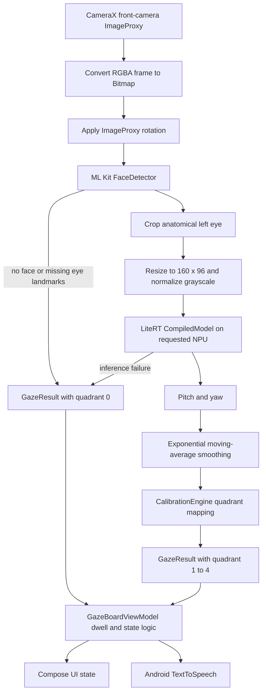
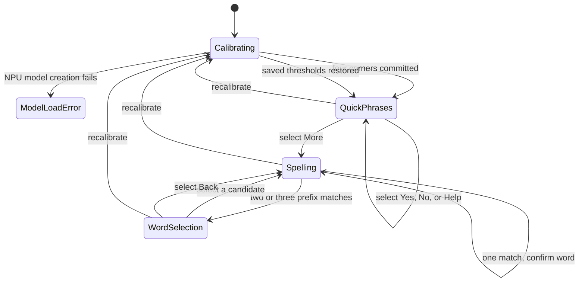

# GazeBoard architecture

This document describes the implementation on the `main` branch. It intentionally excludes planned features and unmeasured performance claims.

## Runtime data flow



`CameraManager` uses a single-thread executor for frame analysis and `STRATEGY_KEEP_ONLY_LATEST` so stale frames do not accumulate. UI state is exposed through `StateFlow`. Camera binding and preview-provider operations are switched to the main dispatcher.

## Frame processing

### Camera acquisition

`CameraManager` binds the front camera to the activity lifecycle with an `ImageAnalysis` use case. It requests 640 x 480 RGBA frames, converts each `ImageProxy` to a bitmap, rotates it according to `rotationDegrees`, and always closes the proxy in a `finally` block.

The code creates a CameraX `Preview` use case, but the current Compose screens do not attach its surface provider. Users therefore do not see a live preview in the rendered UI.

### Eye detection and preprocessing

`EyeDetector` configures ML Kit face detection for fast performance, all landmarks, and a minimum face size of 0.15. It uses the first detected face and requires both eye landmarks.

The crop is centered on the anatomical left-eye landmark. Its width is 0.75 times the detected inter-eye distance, and its height preserves the model's 160:96 aspect ratio. The crop is resized to 160 x 96 pixels and converted with:

```text
gray = (0.299R + 0.587G + 0.114B) / 255
```

The result is a 15,360-element `FloatBuffer`. Face-detection failure, missing landmarks, an inter-eye distance below eight pixels, or an invalid crop ends processing for that frame with quadrant `0`.

### Model execution

`EyeGazeModel.load()` creates a LiteRT `CompiledModel` with `Accelerator.NPU`. It does not configure CPU or GPU fallback. A zero-filled inference is attempted after loading as a warm-up; warm-up failure is logged but does not abort loading.

For each valid eye crop, `runInference()` writes the input buffer, runs the compiled model, and reads output index `2` as pitch and yaw. Model creation failure moves the application to `ModelLoadError`. Per-frame inference failure produces a no-gaze result and leaves the app running.

The code labels the accelerator as `NPU` after `CompiledModel.create()` returns. That label records the requested and successfully created path; this repository does not include an independent hardware-counter trace.

## Gaze result contract

`GazeEstimator.GazeResult` is the boundary between frame processing and application logic.

| Field | Meaning |
| --- | --- |
| `quadrant` | `0` for no usable gaze result, otherwise `1` top-left, `2` top-right, `3` bottom-left, or `4` bottom-right |
| `confidence` | `0.0` on failure and `1.0` on a model result; this is not a calibrated probability |
| `inferenceMs` | Wall-clock duration around the latest `CompiledModel.run()` call |
| `accelerator` | App-assigned accelerator label, currently `NPU` after a successful load |
| `rawPitch`, `rawYaw` | Unsmoothed model outputs used for calibration and telemetry |
| `faceDetectMs` | Wall-clock duration around ML Kit face detection |

The estimator applies an exponential moving average before quadrant mapping:

```text
smoothed = 0.7 * current + 0.3 * previous
```

The first valid sample initializes the smoothed values directly. A reset clears that state.

## Calibration

`CalibrationEngine` collects raw pitch and yaw values while each of four corner targets is displayed. After a 1.5-second dwell, it commits the average of the accumulated samples for that target. Once all four targets are committed, it averages all four pitch values into `pitchMid` and all four yaw values into `yawMid`.

Quadrants are then determined with two comparisons:

```text
pitch < pitchMid and yaw < yawMid  -> top-left
pitch < pitchMid and yaw >= yawMid -> top-right
pitch >= pitchMid and yaw < yawMid -> bottom-left
otherwise                          -> bottom-right
```

The two midpoint values and a calibrated flag are persisted in `SharedPreferences`. Resetting calibration clears in-memory state, but the reset method does not remove the previously stored preference values immediately. A completed replacement calibration overwrites them.

This is threshold calibration, not an affine mapping. It does not estimate screen coordinates, curvature, head-pose compensation, or calibration quality.

## Selection and application state

The ViewModel starts in `Calibrating` while it initializes the model and camera. A saved calibration changes the state to `QuickPhrases` after initialization.



For communication screens, gaze must remain in the same nonzero quadrant for one second. Losing the face or moving to another quadrant resets progress. After a selection, input is ignored for 500 ms.

Quick-phrase selections append text to the displayed sentence and speak the selected phrase. Confirmed spelling candidates append the word and speak that word. Methods exist to speak or clear the accumulated sentence, but no current UI control calls them.

## Word prediction

`TriePredictor` is named for the `WordPredictor` abstraction, but its current implementation is a linear scan over precomputed `(word, gestureCode)` pairs rather than a trie data structure.

| Quadrant | Letters |
| --- | --- |
| 1 | A through G |
| 2 | H through M |
| 3 | N through S |
| 4 | T through Z |

The ordered `words.txt` asset has 378 nonempty rows, including one duplicated row. `predict()` returns the first five entries whose full gesture code begins with the selected sequence. The ViewModel shows a word-selection screen only when two or three results remain, and automatically confirms a sole result.

## Packaging

The app is arm64-only and targets Android API 31 or newer. `qualcomm_runtime_v79` is an install-time dynamic-feature module selected for device groups whose system-on-chip manufacturer and model match Qualcomm or QTI SM8750. The module contains the LiteRT Qualcomm compiler and dispatch plugins plus QAIRT shared libraries.

Because those libraries are in a dynamic feature, directly installing `app/build/outputs/apk/debug/app-debug.apk` is not the supported deployment path. `./gradlew :app:installDebug` invokes the Android Gradle Plugin's bundle-to-APK installation path and includes device-targeted features for the connected device.

## Local data and permissions

The manifest declares camera permission and a required front camera. It does not declare Internet or storage permission. The application stores only calibration midpoint values through its own code. Camera frames and eye crops are passed through memory and are not written to files by the application.

Android text-to-speech runs through the selected system service. Whether that external service has an offline voice installed is outside this application's control.

## Verification boundary

Static inspection confirms that the classes above are wired into one path and that the debug variant compiles. The repository does not contain automated tests, target-device logs, screen recordings, benchmark output, accuracy samples, or hardware traces. Do not infer runtime performance or suitability for assistive use from this architecture alone.
